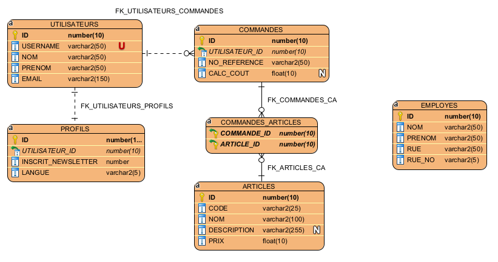

# Basic Order System (Hibernate)
This project is an educational resource to show the students at HEG-Arc how to implement a basic ordering system using Hibernate and following the "Meet-in-the-Middle" approache of programming.

## Prerequisites

Before starting to work with this project, you should:

1. Execute both SQL scripts against your database
2. Update `src/main/resources/META-INF/persistence.xml` with your database connection details

Then you may start the application by running `src/main/java/ch/hearc/ig/ordersystem/Main.java`.

## ER Diagram

